# no_modify
# Toonflow Android-to-Web 界面对比验证文档

- 生成时间：2026-03-24
- 验证范围：Android `Toonflow-game-android` -> Web `Toonflow-game-web`
- 验证方式：源码对照 + `yarn type-check` + `yarn build`
- 结论：主要页面和业务状态已对齐，未发现依赖假数据的页面卡片；剩余差异主要是 Web/Android 运行媒介不同导致的交互实现差异。

## 页面
| 页面 | Android 源位置 | Web 目标文件 | 验证结论 | 说明 |
|---|---|---|------|---|
| 主页 | `MainActivity.kt:323-336, 456-461` | `SceneHome.vue:14-54` | 不通过  |  |
| 故事大厅 | `MainActivity.kt:370-461` | `SceneHall.vue:11-46` | 不通过   |  |
| 创建故事 | `MainActivity.kt:602-1306`、`MainViewModel.kt:841-1018` | `SceneCreate.vue:228-526`、`useToonflowStore.ts:841-1018` | 不通过   |  |
| 游玩页 | `MainActivity.kt:1490-1674`、`MainViewModel.kt:1070-1158` | `ScenePlay.vue:298-520`、`useToonflowStore.ts:1070-1158` | 不通过   |  |
| 聊过 | `MainActivity.kt:1352-1364`、`MainViewModel.kt:1761-1768, 1613-1615` | `SceneHistory.vue:11-39` | 不通过   | |
| 我的 / 设置 | `MainActivity.kt:2127-2254`、`MainActivity.kt:3244-3250`、`MainViewModel.kt:421-439` | `SceneMy.vue:52-116`、`SceneSettings.vue:7-36`、`useToonflowStore.ts:841-905` | 不通过   | |

## 对比list
checkstatus: [] 有fail/suc/ing/wait 多种状态，界面改到完全一致为止
- [fail]  全局
  - [wait] web端不要乱用card 样式。不要乱分块！！！！
  - [wait]  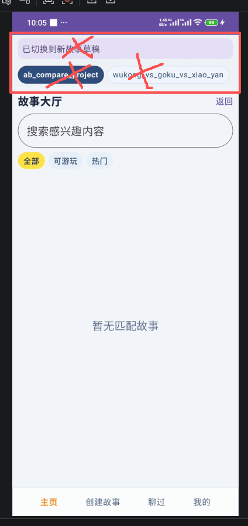 删除多余的这三个东西。 信息提示改为浮动横幅而不是直接嵌入。
  - [wait]  所有多行输入框都得增加滚动条控件！
- [suc]  主页
  安卓：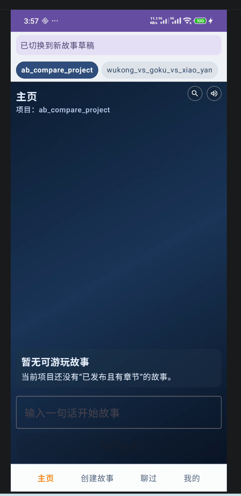
  web: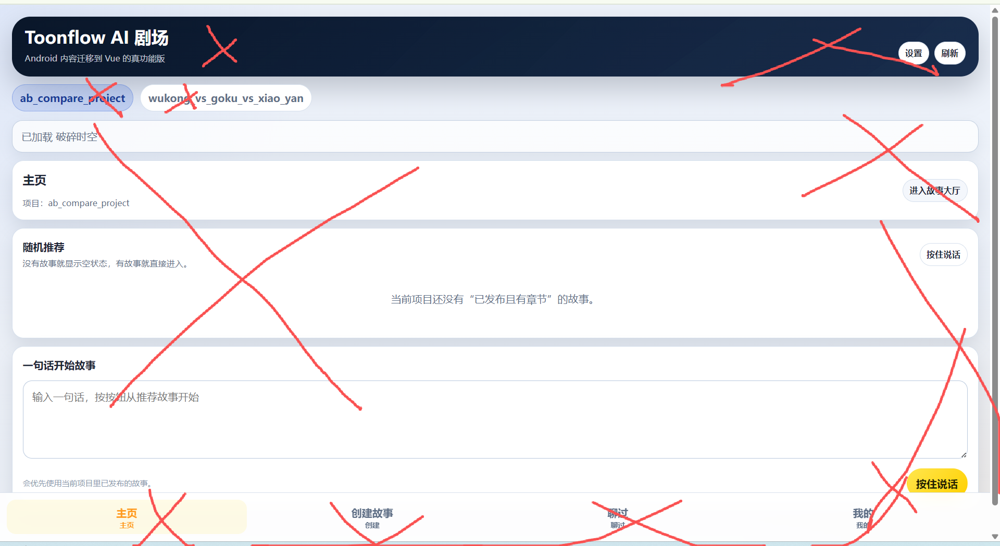
  一整个都fail！！！！！。没有任何一致性可言。垃圾，极度垃圾！！！！
  -  [suc] 重新修改总体效果
  -  [suc] 按钮样式一致性
  -  [wait] 交互一致性
  
  - [ing] 同步修改（web 和安卓都要同步修改）
自己发布或者其他账号发布后有发布的故事。在主页应该有推荐才对。
- [ing] 我的
  安卓：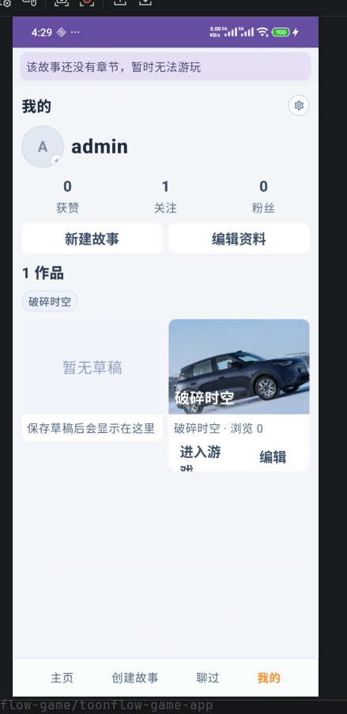
  web: 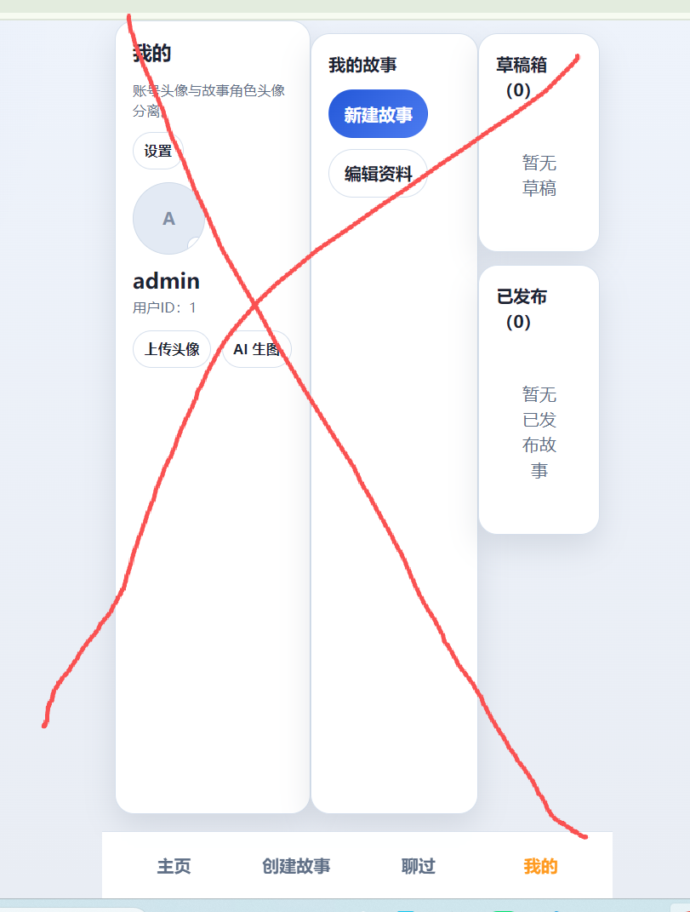
  - [suc] 重新修改总体效果
  布局一致，风格一致，不能有任何差异
   不要乱用card 样式。不要乱分块！！！！
  - [suc] 按钮样式一致性
  - [suc] 交互一致性，
  所以按钮点击后的效果要一致。弹窗要一致 ，面板要一致，跳转要一致
  web:
  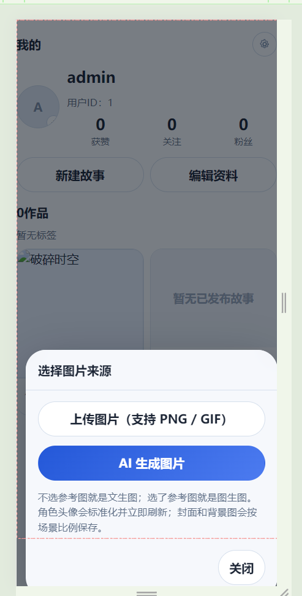
  android:
  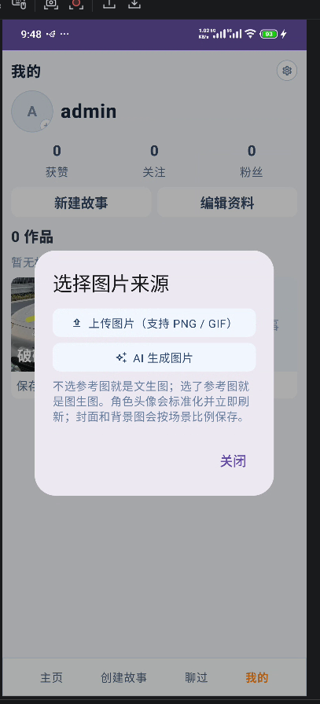
   图像弹框显示位置不一致
  
  - [suc] 同步修改（web 和安卓都要同步修改）
    - [suc]确保真上传到服务器。web 安卓 上传封面 头像后。两边都要看的见
    - [suc] 
  已发布的记录显示调整 删掉“点击进入游戏”这几个字，因为真正要的效果是点击封面就能进入
  编辑按钮放进框里面去！！！！
    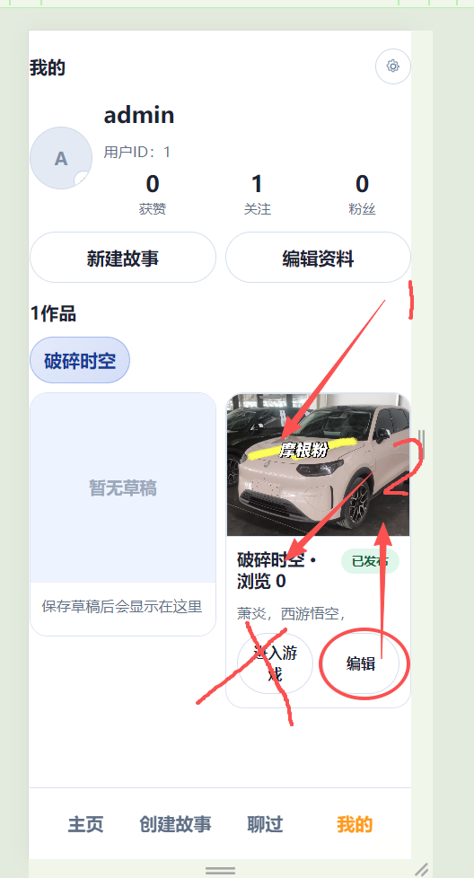 点击1 或者2 就可以进入游戏不需要 “点击进入游戏”这几个字.
    编辑按钮位置不对！！！！。不能让故事块的尺寸如此混乱！！！
    - [suc]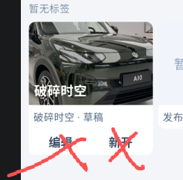 这个点击进入的是草稿箱列表！！！！！这是个入口！！！！ 不管多少个草稿在我的只显示最新修改的封面！！！！
  草稿箱列表展示多个草稿是界面不是框！！！！，点击可以进行删除，编辑等操作。
  草稿箱效果图：

- [suc] 我的-设置
  -  [suc] 同步修改（web 和安卓都要同步修改）
    - [模型配置设计.md](../../../md/plan/ai_game/V3/%E6%A8%A1%E5%9E%8B%E9%85%8D%E7%BD%AE%E8%AE%BE%E8%AE%A1/%E6%A8%A1%E5%9E%8B%E9%85%8D%E7%BD%AE%E8%AE%BE%E8%AE%A1.md)

- [fail]创建故事
web: 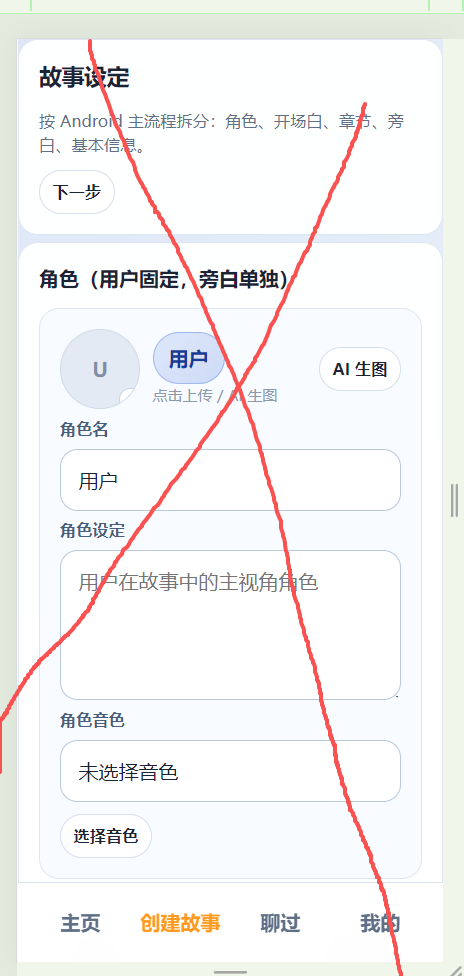
android: 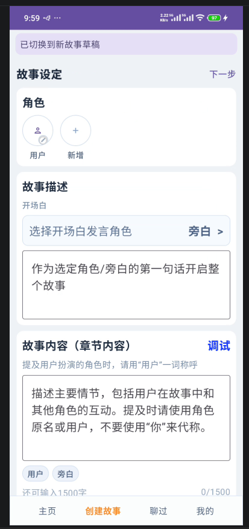
评价:毫无一致性可言
  - [suc] 重新修改总体效果
  布局一致，风格一致，不能有任何差异
   不要乱用card 样式。不要乱分块！！！！
  - [ing] 按钮样式一致性
  - [ing] 交互一致性
  - [ing] 同步修改（web 和安卓都要同步修改）
    - [suc] 点击发布无法正常发布，点击没有任何效果。自己发布或者其他账号发布后有发布的故事。在主页应该有推荐才对。
    - [suc] 持久化机制:点击下一步。存草稿。发布。 都会触发持久化机制 
   - [suc] 编辑头像，各种开关，文字内容。也会触发持久化机制，但是可以进行撤回操作。
   - [ing] 安卓端的多行输入没做滚动条效果？？？全部多行输入都要做滚动条效果。web 端 和安卓端的 章节内容为什无法输入“@”
   - [ing] 章节背景图片没有实现
   - [ing] 添加新章节的效果完全不符合要求。[@md/plan/ai_game/V3/设计/android.md:59-113]
   - [ing] 安卓端的退出故事编辑后第二次进入出现奇怪的缓存。新建也会看见一个草稿打开的角色信息编辑框？？？
   - [ing] web端已经输入了开场白并且保存了，安卓端打开后依然为空
   - [ing] web端点击提及的效果不对 应该是"@xxx " 才对。
   - [ing] 缺少了“全局背景（选填）重要的信息请放最前面”的多行输入框 [android.md](../../../md/plan/ai_game/V3/%E8%AE%BE%E8%AE%A1/android.md)
  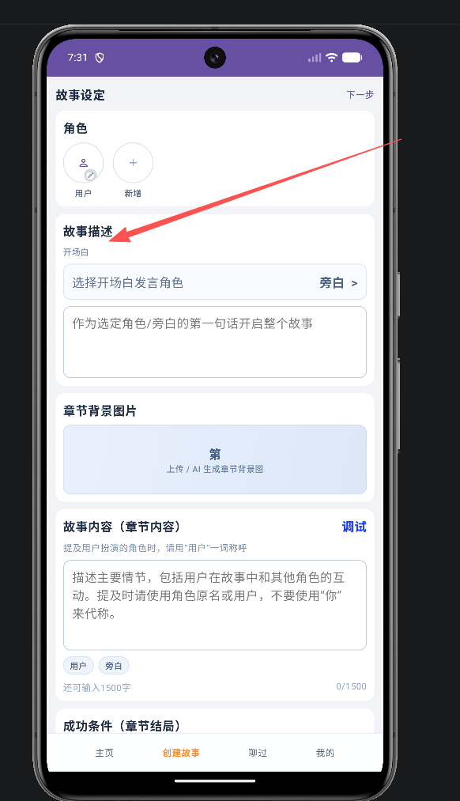
  
- [ing] 编辑故事
与创建故事差不多
  
- [ing]聊过
web: 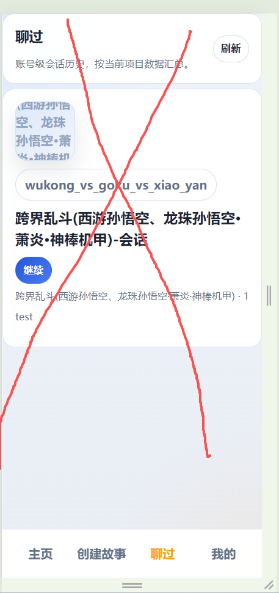
android: 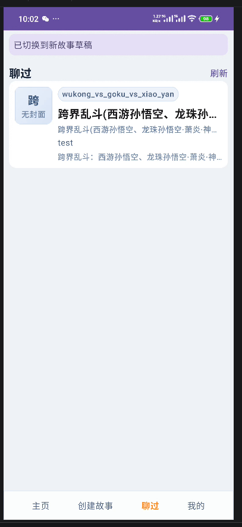
评价:这个界面安卓端也是来乱的（数据），页面风格不一致
  - [ing] 重新修改总体效果
  布局一致，风格一致，不能有任何差异
   不要乱用card 样式。不要乱分块！！！！
  - [ing] 按钮样式一致性
  - [ing] 交互一致性
  - [ing] 同步修改（web 和安卓都要同步修改）
    - [ing] 显示真正聊过的数据，没有聊过就显示暂无数据。点击可以进入故事游玩界面接着游玩。

- [ing]故事大厅
web: 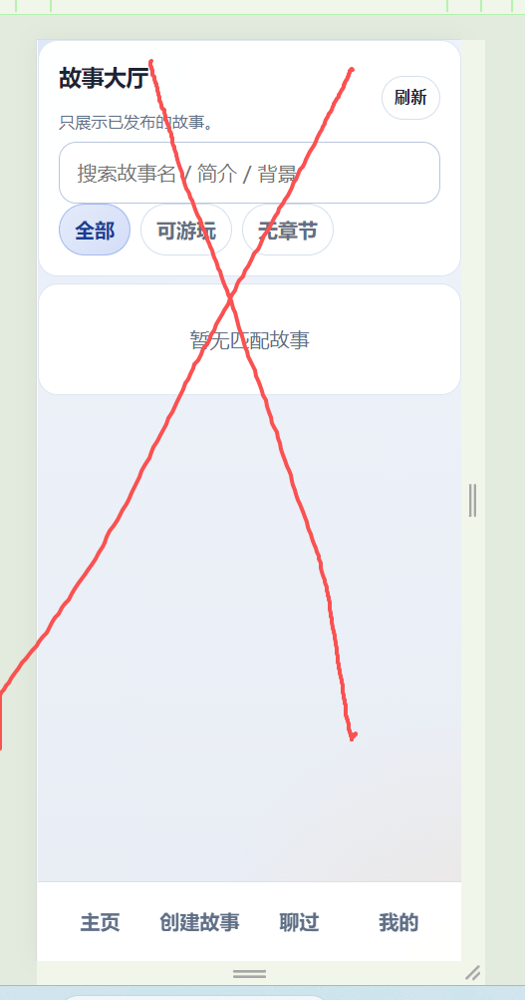
android: 
评价:毫无一致性可言
  - [ing] 重新修改总体效果
  布局一致，风格一致，不能有任何差异
   不要乱用card 样式。不要乱分块！！！！
  - [ing] 按钮样式一致性
  - [ing] 交互一致性
  - [ing] 同步修改（web 和安卓都要同步修改），
   删除多余的这三个东西。 信息提示改为浮动横幅而不是直接嵌入。

- [ing]故事游玩
web:完全没做。入口:主页，故事大厅，聊过，调试（业务是调试的业务），个人的已发布列表点击
安卓:入口:主页，故事大厅，聊过，调试（业务是调试的业务），个人的已发布列表点击
无法正常进入,安卓闪退
demo:[md/plan/ai_game/V3/demo/v2/index.html]
功能说明:[v3.md](../../../md/plan/ai_game/V3/v3.md) 
  - [ing] 重新修改总体效果
  布局一致，风格一致，不能有任何差异
   不要乱用card 样式。不要乱分块！！！！
  - [ing] 按钮样式一致性
  - [ing] 交互一致性
  - [ing] 同步修改（web 和安卓都要同步修改），
    - 实现真正可用的游戏(ai故事)游玩

- [ing]故事调试
与故事游玩差不多
在故事编辑时在即章节旁边的调试按钮进入
[章节结束条件设计（调试）.md](../../../md/plan/ai_game/V3/%E6%B8%B8%E7%8E%A9%E4%B8%9A%E5%8A%A1/%E7%AB%A0%E8%8A%82%E7%BB%93%E6%9D%9F%E6%9D%A1%E4%BB%B6%E8%AE%BE%E8%AE%A1%EF%BC%88%E8%B0%83%E8%AF%95%EF%BC%89.md)